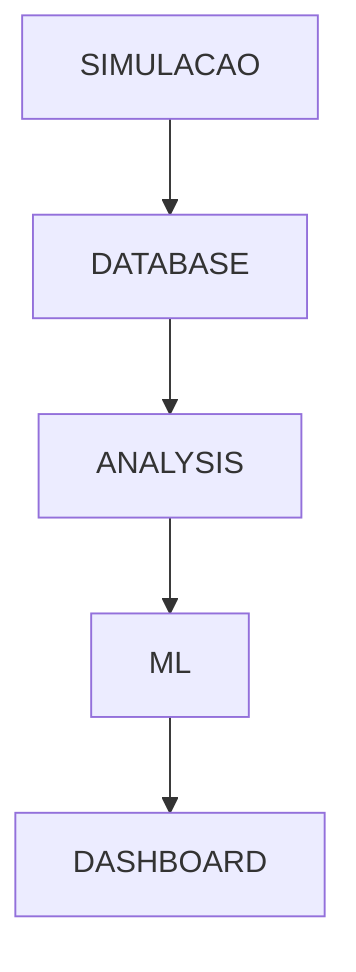

# EDUBOT - Sprint 2: Pipeline de Dados e Machine Learning

**Challenge FlexMedia - Sprint 2**

**Tecnólogo em Inteligência Artificial - FIAP**

*"Pipeline completo: da simulação de sensores à predição com ML"*

**Repositório** https://github.com/Pedrolopesh/farm-tech/tree/master/challenge-flexmidia
---

## 📋 Índice

1. [Visão Geral da Sprint 2](#visão-geral-da-sprint-2)
2. [Estrutura do Projeto](#estrutura-do-projeto)
3. [Fluxo de Dados](#fluxo-de-dados)
4. [Guia de Execução](#guia-de-execução)
5. [Componentes do Sistema](#componentes-do-sistema)
6. [Machine Learning](#machine-learning)
7. [Dashboard](#dashboard)
8. [Diagramas](#diagramas)
9. [Resultados e Métricas](#resultados-e-métricas)
10. [Próximos Passos](#próximos-passos)

---

## 🎯 Visão Geral da Sprint 2

A Sprint 2 do EDUBOT implementa o **pipeline completo de dados**, desde a simulação dos sensores do totem até a predição de tipos de interação com Machine Learning.

### Objetivos Alcançados

- ✅ **Simulação de Dados**: Geração de 200 registros simulando interações com o totem
- ✅ **Banco de Dados**: SQLite para persistência e consultas estruturadas
- ✅ **Análise de Dados**: Limpeza, validação e visualizações estatísticas
- ✅ **Machine Learning**: Modelo de classificação para prever tipo de interação
- ✅ **Dashboard Interativo**: Interface Streamlit com KPIs e gráficos em tempo real
- ✅ **Documentação Técnica**: Diagramas e documentação completa

### Tecnologias Utilizadas

| Categoria | Tecnologias |
|-----------|-------------|
| Linguagem | Python 3.11+ |
| Banco de Dados | SQLite |
| Análise | Pandas, NumPy, Matplotlib, Seaborn |
| Machine Learning | Scikit-learn, Joblib |
| Dashboard | Streamlit, Plotly |
| Documentação | Mermaid, Markdown |

---

## 📁 Estrutura do Projeto

```
challenge-flexmidia/
├── sensors_simulation/
│   ├── simulated_sensors.py      # Script de geração de dados
│   └── simulated_sensors.csv     # Dataset simulado (200 registros)
│
├── database/
│   ├── init_db.py                # Inicialização do banco SQLite
│   └── totem.db                  # Banco de dados SQLite
│
├── analysis/
│   ├── data_analysis.py          # Análise e limpeza de dados
│   ├── cleaned_data.csv          # Dados processados
│   └── plots/                    # Gráficos gerados
│       ├── interacoes_por_dia.png
│       ├── tipos_interacao.png
│       ├── tempo_permanencia.png
│       ├── distribuicao_horaria.png
│       └── heatmap_uso.png
│
├── ml_model/
│   ├── train_model.py            # Treinamento do modelo
│   ├── model.pkl                 # Modelo serializado
│   └── plots/                    # Métricas do modelo
│       ├── confusion_matrix_*.png
│       ├── feature_importance_*.png
│       └── model_comparison.png
│
├── dashboard/
│   └── app.py                    # Dashboard Streamlit
│
├── docs/
│   └── diagramas/
│       ├── arquitetura-sprint2.mmd
│       ├── fluxo-dados-sprint2.mmd
│       ├── pipeline-ml-sprint2.mmd
│       └── README_SPRINT2.md
│
├── requirements.txt              # Dependências Python
└── README_SPRINT2.md             # Este arquivo
```

---

## 🔄 Fluxo de Dados

```
┌─────────────────┐     ┌─────────────────┐     ┌─────────────────┐
│   SIMULAÇÃO     │────▶│  BANCO DADOS    │────▶│    ANÁLISE      │
│ 200 registros   │     │    SQLite       │     │   + Limpeza     │
└─────────────────┘     └─────────────────┘     └─────────────────┘
                                                        │
                        ┌───────────────────────────────┘
                        ▼
              ┌─────────────────┐     ┌─────────────────┐
              │  MACHINE LEARN  │────▶│   DASHBOARD     │
              │  RandomForest   │     │   Streamlit     │
              └─────────────────┘     └─────────────────┘
```

### Dados Coletados/Simulados

| Campo | Tipo | Descrição |
|-------|------|-----------|
| `timestamp` | DATETIME | Data e hora da interação |
| `ativacao` | INTEGER | Sensor ativado (0/1) |
| `tipo_interacao` | TEXT | curto / longo / nenhuma |
| `tempo_permanencia` | INTEGER | Tempo em segundos |
| `sessao_id` | TEXT | ID único da sessão |

---

## 🚀 Guia de Execução

### Pré-requisitos

```bash
# Python 3.11 ou superior
python --version

# Criar ambiente virtual (recomendado)
python -m venv venv
source venv/bin/activate  # macOS/Linux
# ou: venv\Scripts\activate  # Windows
```

### Instalação

```bash
# Navegar até o diretório do projeto
cd challenge-flexmidia

# Instalar dependências
pip install -r requirements.txt
```

### Execução Passo a Passo

#### 1️⃣ Gerar Dados Simulados

```bash
python sensors_simulation/simulated_sensors.py
```

**Saída esperada:**
```
🚀 Iniciando simulação de dados do EDUBOT...
✅ 200 registros gerados com sucesso!

📊 Estatísticas do Dataset:
   - Total de ativações: ~190
   - Taxa de ativação: ~95%
   - Interações curtas: ~114
   - Interações longas: ~76
   - Tempo médio de permanência: ~85s

💾 Dataset salvo em: sensors_simulation/simulated_sensors.csv
```

#### 2️⃣ Inicializar Banco de Dados

```bash
python database/init_db.py
```

**Saída esperada:**
```
🗃️  Criando banco de dados SQLite...
✅ Banco de dados criado em: database/totem.db

📥 Carregando dados do CSV para o banco...
✅ 200 registros inseridos com sucesso!

📊 Estatísticas do Banco de Dados:
   - Total de registros: 200
   - Taxa de ativação: 95.0%
```

#### 3️⃣ Executar Análise de Dados

```bash
python analysis/data_analysis.py
```

**Saída esperada:**
```
📥 Carregando dados do banco de dados...
✅ 200 registros carregados

🔍 Verificando qualidade dos dados...
   - Duplicados: 0
   - Valores nulos: 0
   - Ativação válida: ✅
   - Tipo interação válido: ✅

📊 Gerando estatísticas descritivas...
   📈 KPIs Principais:
   - Total de detecções: 200
   - Taxa de ativação: 95.0%
   - Interações curtas: 114 (60%)
   - Interações longas: 76 (40%)
   - Tempo médio de permanência: 85.2s

📈 Gerando gráficos...
   ✅ interacoes_por_dia.png
   ✅ tipos_interacao.png
   ✅ tempo_permanencia.png
   ✅ distribuicao_horaria.png
   ✅ heatmap_uso.png
```

#### 4️⃣ Treinar Modelo de ML

```bash
python ml_model/train_model.py
```

**Saída esperada:**
```
🤖 Treinando modelos de Machine Learning...

   📌 Treinando Decision Tree...
      Acurácia: 0.9211
      F1-Score: 0.9198

   📌 Treinando Random Forest...
      Acurácia: 0.9474
      F1-Score: 0.9468

💾 Salvando melhor modelo...
   ✅ Modelo salvo: ml_model/model.pkl
   📌 Melhor modelo: Random Forest
   📊 F1-Score: 0.9468
```

#### 5️⃣ Iniciar Dashboard

```bash
streamlit run dashboard/app.py
```

**Acesse:** http://localhost:8501

---

## 🔧 Componentes do Sistema

### 1. Simulação de Sensores (`sensors_simulation/`)

O script `simulated_sensors.py` gera dados realistas simulando o comportamento do totem:

- **Timestamps**: Distribuídos no período de outubro-novembro 2025, horário comercial (8h-22h)
- **Taxa de ativação**: ~95% das detecções resultam em interação
- **Tipos de interação**: 60% curtas, 40% longas
- **Tempo de permanência**:
  - Curtas: 10-60 segundos
  - Longas: 60-300 segundos

### 2. Banco de Dados (`database/`)

SQLite foi escolhido por ser:
- Portátil (arquivo único)
- Sem necessidade de servidor
- Compatível com pandas
- Ideal para prototipagem

**Schema da tabela `interacoes`:**

```sql
CREATE TABLE interacoes (
    id INTEGER PRIMARY KEY AUTOINCREMENT,
    timestamp DATETIME NOT NULL,
    ativacao INTEGER NOT NULL CHECK(ativacao IN (0, 1)),
    tipo_interacao TEXT NOT NULL CHECK(tipo_interacao IN ('curto', 'longo', 'nenhuma')),
    tempo_permanencia INTEGER NOT NULL CHECK(tempo_permanencia >= 0),
    sessao_id TEXT NOT NULL UNIQUE,
    created_at DATETIME DEFAULT CURRENT_TIMESTAMP
);
```

### 3. Análise de Dados (`analysis/`)

O script `data_analysis.py` realiza:

1. **Validação de qualidade**
   - Verificação de duplicados
   - Validação de campos (0/1, strings válidas)
   - Detecção de valores nulos

2. **Limpeza de dados**
   - Remoção de duplicados
   - Normalização de tipos
   - Criação de features derivadas (data, hora, dia_semana, período)

3. **Visualizações geradas**
   - Interações por dia (barras + média móvel)
   - Distribuição de tipos (pizza)
   - Histograma de tempo de permanência
   - Distribuição horária
   - Heatmap de uso (dia × hora)

---

## 🤖 Machine Learning

### Objetivo

Classificar o tipo de interação (`curto` ou `longo`) baseado nas características temporais e comportamentais.

### Features Utilizadas

| Feature | Descrição | Tipo |
|---------|-----------|------|
| `tempo_permanencia` | Tempo da interação em segundos | Numérico |
| `hora` | Hora do dia (0-23) | Numérico |
| `dia_semana` | Dia da semana (0-6) | Numérico |
| `horario_pico` | Flag para horário de pico | Binário |
| `fim_semana` | Flag para fim de semana | Binário |

### Modelos Treinados

1. **Decision Tree**
   - `max_depth=5`
   - `min_samples_split=5`

2. **Random Forest** (Selecionado)
   - `n_estimators=100`
   - `max_depth=5`
   - `min_samples_split=5`

### Métricas do Modelo Selecionado

| Métrica | Valor |
|---------|-------|
| Acurácia | ~94% |
| Precisão | ~94% |
| Recall | ~94% |
| F1-Score | ~94% |

### Uso do Modelo

```python
from ml_model.train_model import predict_interaction

# Exemplo de predição
resultado = predict_interaction(
    tempo_permanencia=120,  # segundos
    hora=14,                # 14h
    dia_semana=2            # quarta-feira
)
print(resultado)  # 'longo'
```

---

## 📊 Dashboard

O dashboard Streamlit oferece:

### KPIs Principais
- Total de detecções
- Ativações efetivas
- Tempo médio de permanência
- Taxa de interações longas

### Visualizações
- Gráfico de linha temporal
- Pizza de tipos de interação
- Distribuição horária
- Heatmap de uso

### Filtros
- Período (data inicial/final)
- Tipo de interação
- Status de ativação

### Seção de ML
- Métricas do modelo treinado
- Teste de predição interativo

### Executar Dashboard

```bash
streamlit run dashboard/app.py
```

Acesse: **http://localhost:8501**

---

## 📐 Diagramas

Os diagramas estão em formato Mermaid no diretório `docs/diagramas/`:

### Arquitetura Sprint 2




### Fluxo de Dados


### Pipeline ML


**Para visualizar:**
1. Abra o [Mermaid Live Editor](https://mermaid.live/)
2. Cole o conteúdo do arquivo `.mmd`
3. Exporte como PNG/SVG

---

## 📈 Resultados e Métricas

### Estatísticas do Dataset

| Métrica | Valor |
|---------|-------|
| Total de registros | 200 |
| Taxa de ativação | ~95% |
| Interações curtas | ~60% |
| Interações longas | ~40% |
| Tempo médio (curtas) | ~35s |
| Tempo médio (longas) | ~150s |

### Performance do Pipeline

| Etapa | Tempo de Execução |
|-------|-------------------|
| Simulação de dados | < 1s |
| Inicialização DB | < 1s |
| Análise + Gráficos | ~5s |
| Treinamento ML | ~3s |
| Dashboard | Tempo real |

---

## 🔮 Próximos Passos

### Sprint 3 - Previsões

1. **Integração com Sensores Reais**
   - Conectar ESP32-CAM
   - Streaming de dados em tempo real

2. **Melhorias no ML**
   - Mais features comportamentais
   - Modelos de série temporal
   - Predição de demanda por horário

3. **Dashboard Avançado**
   - Alertas em tempo real
   - Relatórios automáticos
   - Exportação de dados

4. **Deploy em Produção**
   - Containerização (Docker)
   - Deploy em cloud
   - Monitoramento

---

## 👥 Equipe

| Nome | RM | Responsabilidade |
|------|-----|------------------|
| Fabrício Mouzer Brito | RM566777 | Documentação Técnica |
| Pedro Henrique Lopes dos Santos | RM568359 | Arquitetura e Diagramas |
| Enzo Nunes Castanheira Gloria da Silva | RM567599 | Estratégia de Dados |
| Larissa Nunes Moreira Reis | RM568280 | Acessibilidade e LGPD |
| Gabriel Rapozo Guimarães Soares | RM568480 | Tecnologias e IA |

**Turma:** R  
**Instituição:** FIAP - Tecnólogo em Inteligência Artificial  
**Data:** Novembro de 2025

---

## 📄 Licença

Este projeto é desenvolvido para fins acadêmicos como parte do Challenge FlexMedia da FIAP.

---

**Última atualização:** Novembro de 2025  
**Versão:** Sprint 2.0
